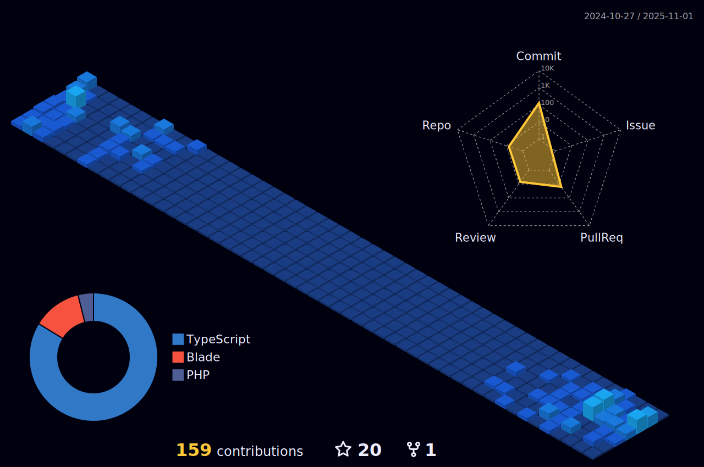

<h1 align="center">Hi there👋</h1>

I'm Jhondel Caranay, a passionate software developer.

<!-- GitHub Profile 3D Contrib -->

## GitHub Contributions

## GitHub Stats

## Top Languages

## GitHub Streak

## Skills

- 
- 
- 
- 
- 
- 
- 
- 
- 
- 
- 
- 

## Profile Views

## Let's Connect

- 
- 
- 

Feel free to explore my repositories and connect with me! 🚀
